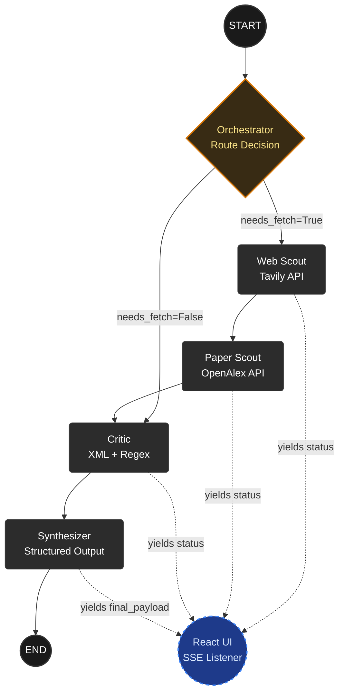

# Tarka (तर्क)

Tarka is a multi-agent AI research assistant built to demonstrate how structured reasoning and deterministic extraction solve LLM hallucination and "schema fatigue." 

It accepts a complex, contested query, searches the open web and academic literature simultaneously, cross-examines the findings using an adversarial LLM Critic, and streams the contradictions and consensus points directly to a React frontend via Server-Sent Events (SSE).

The project was built day by day, layer by layer, moving from a naive linear script to a fully decoupled, self-correcting agentic pipeline.

---

## Why it exists

When researching any complex topic today (e.g., "Do LLMs reason cognitively?" or "Is intermittent fasting effective for weight loss?"), you are forced to juggle browser tabs across marketing blogs, news articles, and academic papers. These sources frequently contradict each other—and nobody tells you that.

The naive approach to automating this is to give an LLM a massive context window of articles and ask for a JSON summary. Under real load, this breaks down. The LLM either hallucinates agreement where none exists, or it suffers "schema fatigue" (refusing to populate strict JSON arrays while performing deep logical inversions).

Tarka was built to solve this architecturally. Not by using a larger, more expensive model, but by decoupling the "thinking" from the "formatting," using native Python Regex for deterministic extraction, and wrapping the execution in a stateful LangGraph pipeline.

---

## Performance

All benchmarks were run locally against the complete graph architecture. Day 1/2 represents the baseline (cold network calls). The "Follow-up" metrics demonstrate the Orchestrator bypassing network I/O to interrogate existing state memory.

| Metric | Standing Desks improve productivity | Intermittent fasting for weight loss | Social media causes teen depression | Average |
|---|---:|---:|---:|---:|
| **Cold Latency (End-to-End)** | 22.52s | 21.83s | 22.93s | **22.42s** |
| **Follow-up Latency (Scouts Skipped)** | 19.41s | 16.99s | 14.84s | **17.08s** |
| **Average Consensus Points Found** | 3 | 3 | 2 | **2.6** |
| **Average Contradictions Found** | 1 | 0 | 1 | **0.6** |

*Note: The follow-up latency reduction directly validates the Orchestrator routing map—eliminating external I/O entirely and devoting remaining latency strictly to Critic and Synthesizer inference over pre-cached context.*

---

## Architecture



---

## Running locally

```bash
# 1. Spin up the FastAPI backend via Docker
docker compose up -d --build

# 2. Start the React frontend
cd frontend
npm install
npm run dev

# API streams at: http://localhost:8000/api/research
# UI runs at:     http://localhost:5173
```

---

## Features

**Decoupled Critic Node (XML + Regex Parsing).** Forcing an LLM to output rigid JSON while performing deep logical analysis causes silent failures (dropped arrays). Tarka decouples this: the Critic model "thinks" freely in plain text wrapped in XML tags, and a deterministic Python regex parser extracts the data safely into the state dictionary. 

**Stateful Orchestration & Follow-up Memory.** A LangGraph `TarkaState` dictionary is maintained across nodes. The Orchestrator evaluates the incoming payload and conditionally routes the graph. If it detects a follow-up query, it explicitly bypasses the network scouts, sending the user's new question directly to the Critic to be analyzed against the pre-fetched context.

**Server-Sent Events (SSE) Streaming.** Standard HTTP requests block until the LLM finishes, leaving the user staring at a spinner for 20 seconds. Tarka uses FastAPI's `StreamingResponse` linked to LangGraph's `.astream()`. As each node finishes, it yields a JSON chunk. The React frontend uses the native Fetch ReadableStream API to parse these chunks line-by-line, updating the UI dynamically.

**Semantic Academic Integration.** The pipeline utilizes the OpenAlex API to handle semantic abstraction and complex logic queries natively, pulling high-quality academic abstracts to cross-examine against open web claims.

**Dynamic Synthesis & Follow-up Matrix.** The Synthesizer is a dedicated formatting node that applies strict Pydantic schemas (via `.with_structured_output()`) to the raw state data. Because it performs zero reasoning, it reliably packages the metrics, consensus arrays, and generates context-aware follow-up questions for the UI.

**Hallucination Guard.** If either the web or paper scout returns empty results, 
the Critic node exits early rather than running analysis on partial data. 
An LLM cross-examining only one source will invent the opposing side. 
The guard prevents this entirely.
---

## Honest Limitations and Technical Trade-offs

Building a multi-agent reasoning engine highlights several edge cases in current LLM capabilities and API ecosystems. Current limitations include:

* **Ephemeral Memory:** Conversation history is maintained in the LangGraph state per React session. If the frontend is refreshed, the memory is wiped. There is currently no Postgres or Redis layer persisting sessions for long-term user accounts.
* **Sequential Scouting:** The Web Scout and Paper Scout currently run sequentially. They are entirely independent and should be configured to run in parallel using LangGraph's parallel fan-out execution, which would shave ~2 seconds off the cold start latency.
* **No Authentication or Rate Limiting:** This is built as a portfolio demonstration. If deployed to the public web, the API keys would require a Redis-backed rate limiter and authentication layer to prevent abuse.
* **Desktop-First UI:** The frontend was designed to display dense, side-by-side matrices of academic and web quotes. The CSS Flexbox layout prioritizes wide monitors and requires optimization for mobile viewports.

---

## Stack

FastAPI · LangGraph · LangChain · React · TailwindCSS · Docker Compose · Claude 4.5 Haiku · Tavily API · OpenAlex API