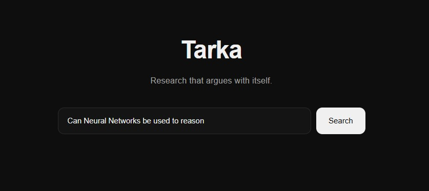
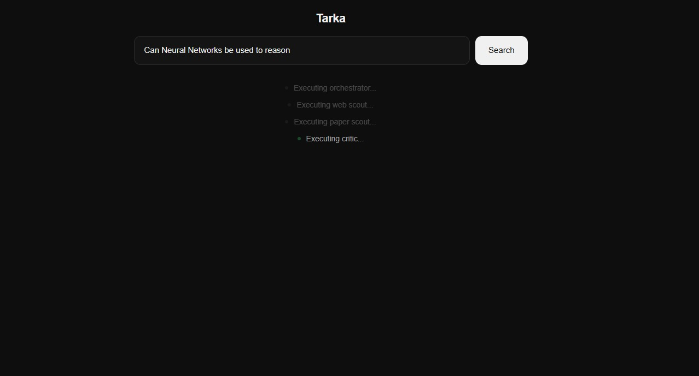
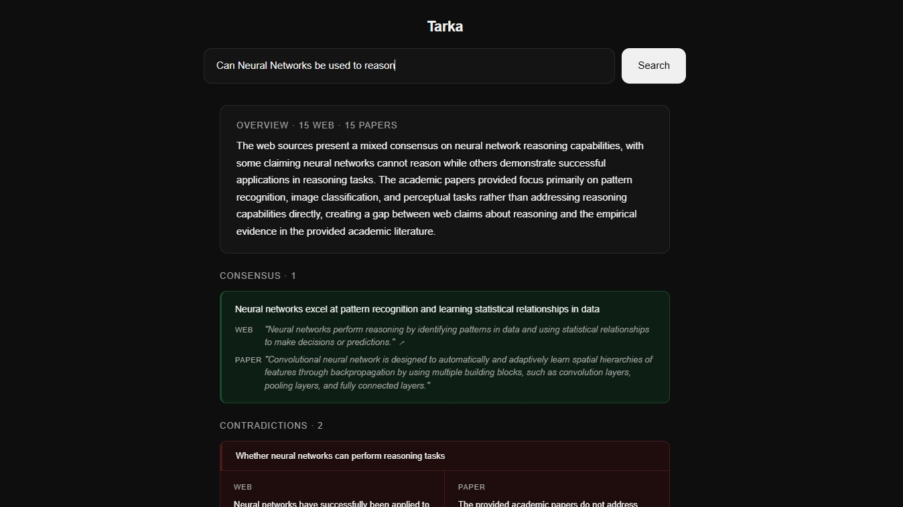
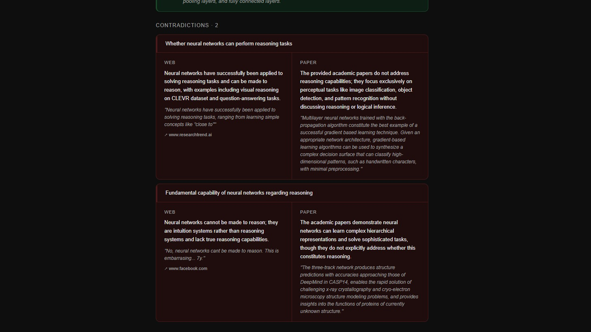
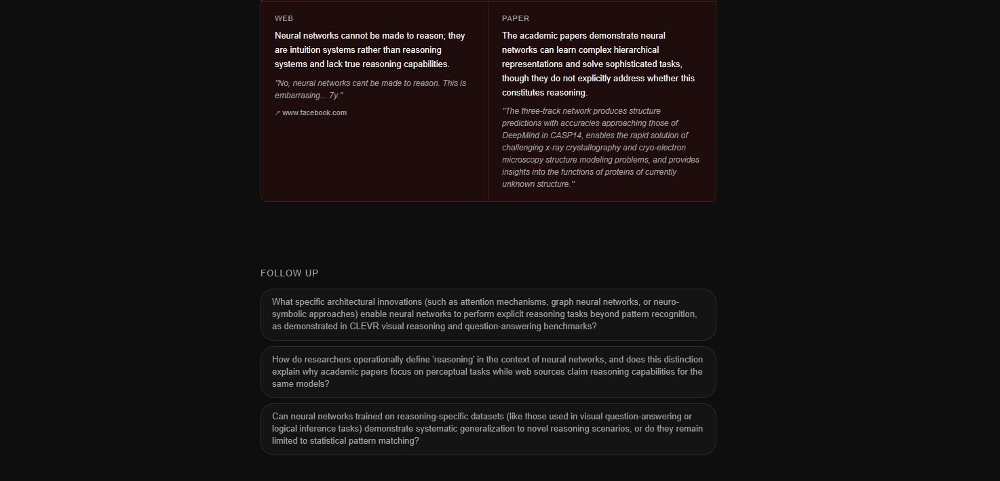

# Tarka — Live Demo Guide

This document outlines the optimal "Golden Path" for demonstrating Tarka during an interview, portfolio review, or team presentation. 

## 1. Preparation
Before sharing your screen, ensure the environment is running:
1. **Backend:** `docker compose up -d` (Ensures the FastAPI server is running on port 8000)
2. **Frontend:** `npm run dev` (Runs the Vite React app on port 5173)

---

## 2. Step-by-Step Presentation Walkthrough

For this walkthrough, we will use the query: **"Can Neural Networks be used to reason?"**

### Step 1: The Hook (The Landing Page)
Start by introducing the core problem: researching complex topics requires juggling a dozen tabs, and no search engine tells you when sources explicitly disagree. Enter Tarka: *Research that argues with itself.*

### Step 2: The Agentic Transparency (SSE Streaming)
Hit "Search". Point out that there is no infinite loading spinner. Explain that the React frontend is consuming a Server-Sent Events (SSE) stream from the FastAPI backend. You are watching a LangGraph multi-agent pipeline execute in real-time. 
* **Orchestrator** is checking memory.
* **Scouts** are hitting Tavily and OpenAlex.
* **Critic** is running the XML/Regex extraction.

### Step 3: The Overview & Consensus
Once the data lands, skip straight to the Overview block. Explain that the **Synthesizer node** took the chaotic XML data and mapped it into a strict JSON contract. 
Show the green **Consensus** block—this proves the LLM isn't just being adversarial for the sake of it; it successfully identifies where the internet and academia actually agree (e.g., pattern recognition).

### Step 4: The Value Proposition (Contradictions)
Scroll down to the red **Contradictions** block. This is the "Aha!" moment.
Show how the Critic node isolated the exact friction point. Read the Web claim vs. the Paper claim. Point out the literal text quotes extracted directly from the source material, ensuring the AI isn't hallucinating the disagreement. 

### Step 5: The Loop (Dynamic Follow-ups)
Scroll to the bottom to reveal the **Follow Up** chips. 
Explain that the Orchestrator maintains state memory. If you click one of these Synthesizer-generated questions, the graph bypasses the network fetch (saving 15+ seconds and API credits) and immediately re-analyzes the existing documents contextually. It turns a static search into an interactive cross-examination.

