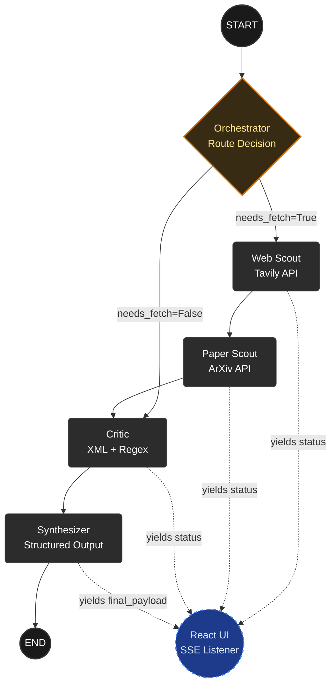

# Tarka (तर्क) — Project Documentation

## 1. What Tarka Is

**Tarka** is a multi-agent AI research assistant that takes an AI/ML question, searches the open web and academic papers simultaneously, finds where they agree and where they contradict each other, and lets you interrogate the synthesis interactively.

Named after *Tarka* (तर्क) — the tool of logical inference in Nyāya philosophy. The Nyāya school used tarka specifically to expose contradictions in a position and thereby get closer to truth. That's exactly what the Critic agent does.

### The Problem It Solves

When you research any AI/ML topic today, you're juggling browser tabs across blog posts, Twitter threads, and ArXiv abstracts. They frequently contradict each other — and nobody tells you that. A paper from 2024 might show LLMs fail at planning tasks while every popular blog says they reason well. You only discover this if you happen to read both carefully.

Tarka automates that cross-referencing layer and makes the disagreements explicit and citable.

### Architecture

Five nodes connected as a LangGraph state graph:

```
User Query
    ↓
Orchestrator       ← decides whether to fetch or use existing context
    ↓         ↓
Web Scout   Paper Scout    ← run sequentially (parallel-ready later)
    ↓         ↓
        Critic             ← finds contradictions and consensus
          ↓
      Synthesizer          ← produces structured JSON output
          ↓
    Memory Layer           ← stores conversation history for follow-ups
          ↓
       FastAPI
          ↓
       React UI
```

| Node | What it does | Tool |
|---|---|---|
| Orchestrator | Routes the query, sets `needs_fetch` flag | — |
| Web Scout | Fetches open-web claims | Tavily API |
| Paper Scout | Fetches paper abstracts and findings | OpenAlex API |
| Critic | Cross-examines both, flags contradictions and consensus | LLM |
| Synthesizer | Packages everything into a typed JSON schema | LLM + Pydantic |

### Tech Stack

| Layer | Choice |
|---|---|
| Agent framework | LangGraph + LangChain |
| LLM | Claude Haiku 4.5 (`claude-haiku-4-5-20251001`) via `langchain-anthropic` |
| Web search | Tavily API |
| Academic search | OpenAlex REST API (via `requests`) |
| Backend | FastAPI + SSE streaming |
| Frontend | React + Tailwind (Vite) |
| Memory | In-context conversation history (per session) |

---

## Day 1 — Infrastructure + Web Scout

### Goal
Get the project skeleton up, define the shared state contract, wire up Tavily, and compile the first working graph. By end of day: pass a query in, get structured web results out.

### What Was Built

#### A. Shared State — `backend/graph/state.py`

The state is a `TypedDict` — a shared dictionary that every node reads from and writes back to. Nodes only return the keys they update; LangGraph merges those updates into the running state automatically.

Day 1 only needs two fields. The rest get added incrementally as we build each node.

```python
from typing import TypedDict, List, Dict, Any

class TarkaState(TypedDict):
    query: str
    web_results: List[Dict[str, Any]]
```

#### B. Web Scout Node — `backend/agents/web_scout.py`

This node takes the query from state, calls Tavily, and normalizes the response into a consistent shape: `url`, `title`, `claim`, `date`. It returns only `web_results` — the Orchestrator handles the rest.

Tavily is used instead of raw Google because it's purpose-built for LLM agents — it returns clean, pre-extracted text rather than raw HTML, which means we skip a whole parsing layer.

```python
def web_scout_node(state: TarkaState) -> dict:
    response = tavily_client.search(
        query=state["query"],
        max_results=5,
        include_raw_content=False
    )
    results = [
        {
            "url": item.get("url"),
            "title": item.get("title"),
            "claim": item.get("content"),
            "date": item.get("published_date", "Unknown")
        }
        for item in response.get("results", [])
    ]
    return {"web_results": results}
```

#### C. Graph Assembly — `backend/graph/graph.py`

A minimal LangGraph: `START → web_scout → END`. One node, one edge. This is intentionally small — the graph grows one node at a time across Days 2-5.

```python
from langgraph.graph import StateGraph, START, END
from graph.state import TarkaState
from agents.web_scout import web_scout_node

def build_graph():
    graph = StateGraph(TarkaState)
    graph.add_node("web_scout", web_scout_node)
    graph.add_edge(START, "web_scout")
    graph.add_edge("web_scout", END)
    return graph.compile()
```

#### D. Test Run — `backend/main.py`

```python
from graph.graph import build_graph

graph = build_graph()
result = graph.invoke({"query": "Can LLMs reason?", "web_results": []})

for item in result["web_results"]:
    print(f"[{item['date']}] {item['title']}")
    print(f"  {item['claim'][:200]}")
    print(f"  {item['url']}\n")
```

### Milestone
Graph compiles and runs. Query goes in, five structured web results come out. The state contract is locked — every future node builds on top of it.

### What's Next (Day 2)
Add the `paper_scout_node` using the `arxiv` package. Extend `TarkaState` with `paper_results`. By end of Day 2, you'll see web results and paper abstracts side by side for the same query — and you'll already spot disagreements manually. That's the setup for the Critic on Day 4.

## Tarka — Day 2: Paper Scout

### What Day 2 Is About

Day 1 gave us web results — blog posts, product announcements, opinion pieces. Useful, but they don't carry citations or empirical evidence. To find *real* contradictions, we need to compare what the web says against what peer-reviewed papers actually show.

Day 2 adds the Paper Scout node, which queries ArXiv and pulls back paper abstracts, authors, and publication years. By end of day, the same query returns both web results and paper findings side by side. You'll start seeing disagreements manually — that's the entire setup for the Critic on Day 4.

---

### One Problem Worth Noting

When you pass a conversational query like *"Can LLMs reason?"* directly to the ArXiv search client, it interprets "Can" as an author name and returns papers by authors literally named "Can". 

The fix is a lightweight query cleaner that strips stop-words before hitting the ArXiv endpoint:

```python
import re

STOP_WORDS = {"can", "what", "is", "are", "how", "do", "does", "the", "a", "an"}

def clean_query(query: str) -> str:
    words = re.sub(r'[^\w\s]', '', query.lower()).split()
    keywords = [w for w in words if w not in STOP_WORDS]
    return " ".join(keywords)
```

*"Can LLMs reason?"* → `"llms reason"` → ArXiv returns papers on LLM reasoning, not papers by an author named Can.

---

### What Was Built

#### State Update — `backend/graph/state.py`

Added `paper_results` to the shared state. Each paper carries title, authors, abstract summary, publication year, and ArXiv ID.


#### Paper Scout Node — `backend/agents/paper_scout.py`

Queries ArXiv, maps the response into the same clean shape we used for web results.

```python

search_query = clean_arxiv_query(user_query)
    
    search = arxiv.Search(
        query=search_query,
        max_results=5,
        sort_by=arxiv.SortCriterion.Relevance
    )
```

#### Graph Update — `backend/graph/graph.py`

Added `paper_scout` as a second node. Graph is now sequential: `START → web_scout → paper_scout → END`.

```python
def build_graph():
    graph = StateGraph(TarkaState)
    graph.add_node("web_scout", web_scout_node)
    graph.add_node("paper_scout", paper_scout_node)
    graph.add_edge(START, "web_scout")
    graph.add_edge("web_scout", "paper_scout")
    graph.add_edge("paper_scout", END)
    return graph.compile()
```

#### Test Run — `backend/main.py`

```python
from graph.graph import build_graph

graph = build_graph()
result = graph.invoke({
    "query": "Can LLMs reason?",
    "web_results": [],
    "paper_results": []
})

print("=== WEB ===")
for item in result["web_results"]:
    print(f"[{item['date']}] {item['title']}")
    print(f"  {item['claim'][:200]}\n")

print("=== PAPERS ===")
for paper in result["paper_results"]:
    print(f"[{paper['year']}] {paper['title']}")
    print(f"  {paper['authors']}")
    print(f"  {paper['summary'][:200]}\n")
```

---

### Milestone

Running the graph now returns web results and paper abstracts side by side for the same query. Data ingestion phase is complete.

| End-to-end pipeline latency (cold, no memory) | ~3.0s | — |

### What's Next (Day 3)

Add the Orchestrator node. Its job is to set a `needs_fetch` flag — first queries fetch from both scouts, follow-up questions skip the network calls entirely and use existing results. That's what makes multi-turn conversation efficient without burning API credits.

## Tarka — Day 3: Orchestrator + Conditional Routing

### What Day 3 Is About

A linear pipeline is fine when every query needs fresh data. But in a multi-turn conversation, re-running both scouts for a follow-up question wastes ~3 seconds and burns API credits for no reason. The data is already in state.

Day 3 fixes this by adding an Orchestrator node that checks whether we actually need to fetch, and conditional edges that route the graph based on that decision.

---

### How Conditional Routing Works in LangGraph

Normal edges are fixed: A → B, always. Conditional edges say: *after this node, look at the state and decide where to go next.*

```python
graph.add_conditional_edges(
    "orchestrator",
    routing_function,           # reads state, returns a string
    {
        "fetch": "web_scout",   # if routing_function returns "fetch"
        "skip": "synthesizer"   # if routing_function returns "skip"
    }
)
```

The routing function doesn't call the next node directly — it just returns a string key. LangGraph maps that key to the next node. The nodes themselves stay decoupled.

---

### What Was Built

#### State Update — `backend/graph/state.py`

Two new fields. `needs_fetch` controls routing. `conversation_history` is planted now and used properly on Day 6.

```python
from typing import TypedDict, List, Dict, Any

class TarkaState(TypedDict):
    query: str
    web_results: List[Dict[str, Any]]
    paper_results: List[Dict[str, Any]]
    needs_fetch: bool
    conversation_history: List[Dict]
```

#### Orchestrator Node — `backend/agents/orchestrator.py`

Simple rule for now: empty conversation history means fresh query, fetch. Non-empty means follow-up, skip.

```python
from graph.state import TarkaState

def orchestrator_node(state: TarkaState) -> dict:
    is_followup = len(state.get("conversation_history", [])) > 0
    return {"needs_fetch": not is_followup}
```

#### Routing Function + Graph Update — `backend/graph/graph.py`

```python
def route_after_orchestrator(state: TarkaState) -> str:
    return "fetch" if state["needs_fetch"] else "skip"

def build_graph():
    graph = StateGraph(TarkaState)

    graph.add_node("orchestrator", orchestrator_node)
    graph.add_node("web_scout", web_scout_node)
    graph.add_node("paper_scout", paper_scout_node)

    graph.add_edge(START, "orchestrator")
    graph.add_conditional_edges(
        "orchestrator",
        route_after_orchestrator,
        {
            "fetch": "web_scout",
            "skip": END
        }
    )
    graph.add_edge("web_scout", "paper_scout")
    graph.add_edge("paper_scout", END)

    return graph.compile()
```

---

### The Routing Map

START
↓
Orchestrator
├── needs_fetch=True  → Web Scout → Paper Scout → END
└── needs_fetch=False → END (existing results preserved in state)

---

### Milestone

**Fresh query (~3010ms):** Orchestrator sets `needs_fetch=True`, both scouts run, results populate state.

**Follow-up (~7ms):** Orchestrator sets `needs_fetch=False`, scouts are bypassed entirely, existing results pass through untouched.

That 7ms number is the baseline for the memory layer story on Day 6.

### What's Next (Day 4)

The Critic node — the hardest day. It receives both scouts' outputs and cross-examines them for contradictions and consensus. The challenge isn't the structure, it's the prompt: getting an LLM to flag real contradictions without hallucinating ones that don't exist.

# Tarka — Day 4: Critic Node

## What Day 4 Is About

The Critic is Tarka's core value proposition. Everything before this — the scouts, the orchestrator, the routing — was plumbing. This is the node that actually does the thing Tarka promises: find where the web and academic literature disagree.

The goal is straightforward. Take web results and paper abstracts, cross-examine them, and return two structured lists — consensus points where both sources agree, and contradictions where they don't.

Getting there took most of Day 4.

---

## What Didn't Work (And Why)

The first approach used LangChain's `with_structured_output()` bound to a Pydantic schema (`CriticAnalysis` with nested `ConsensusModel` and `ContradictionModel` lists). The model consistently returned empty lists despite having good data.

The root cause was a competition between the `overall_summary` field and the structured lists. The model would do all its analytical reasoning inside the summary, then treat the structured fields as optional extras and leave them empty. Moving `overall_summary` to last in the schema, removing it entirely, splitting into two separate API calls, adjusting temperature from 0.0 to 0.7 — none of it reliably fixed the problem.

The structured output approach was abandoned. `with_structured_output()` is unreliable for complex nested schemas when the model has competing reasoning tasks in the same call.

---

## What Works: XML Generation + Regex Parsing

Instead of asking the model to return structured JSON, ask it to generate XML tags and parse those tags with regex. Two steps:

**Pass 1 — Generation:** Send a prompt asking the model to wrap its findings in explicit XML tags (`<consensus_point>`, `<contradiction_point>`, `<summary>`). Plain text generation, no schema enforcement.

**Pass 2 — Parsing:** Extract blocks with `re.findall`, pull individual fields with `re.search`. If a field is missing, default to `"N/A"`. No validation errors, no empty list failures.

This is more robust than `with_structured_output` for this use case because the model generates freely and the structure is imposed afterwards by the parser, not enforced during generation.

---

## The Prompt

The prompt that works gives the model a required XML structure and a small set of clear rules:

```python
system_instruction = (
    "You are an adversarial expert research evaluator cross-examining public claims against peer-reviewed evidence.\n"
    "Your objective is to thoroughly analyze the raw text blocks and output your findings using STRICT XML tags.\n\n"
    "RULES:\n"
    "1. Do NOT use Markdown formatting. Do NOT include conversational filler.\n"
    "2. Only output the requested tags and their contents.\n"
    "3. If you find no consensus or no contradictions, simply omit those specific tags.\n"
    "4. Output 'N/A' for any missing URLs or Paper IDs.\n\n"
    "REQUIRED STRUCTURE:\n"
    "<analysis>\n"
    "  <summary>2-3 sentence overview of the general trend.</summary>\n"
    "  <consensus_point>\n"
    "    <point>Core concept where both sources align</point>\n"
    "    <web_quote>Snippet from web</web_quote>\n"
    "    <source_url>URL</source_url>\n"
    "    <paper_quote>Snippet from paper</paper_quote>\n"
    "    <source_paper_id>Paper ID</source_paper_id>\n"
    "  </consensus_point>\n"
    "  <contradiction_point>\n"
    "    <conflict_topic>Specific focus of disagreement</conflict_topic>\n"
    "    <web_claim>Web's stance</web_claim>\n"
    "    <web_quote>Snippet from web</web_quote>\n"
    "    <source_url>URL</source_url>\n"
    "    <paper_claim>Paper's opposing stance</paper_claim>\n"
    "    <paper_quote>Snippet from paper</paper_quote>\n"
    "    <source_paper_id>Paper ID</source_paper_id>\n"
    "  </contradiction_point>\n"
    "</analysis>"
)
```

Key decisions:
- Temperature 0.3 — low enough for analytical consistency, not so low the model refuses to commit
- Claude Haiku 4.5 — fast and cheap for this generation task, quality holds up
- SystemMessage + HumanMessage split — role and rules in system, data in human

---

## What Was Built

#### Critic Node — `backend/agents/critic_two_pass.py`


#### Graph Update — `backend/graph/graph.py`

Replace `critic_node` import with `critic_two_pass_node`. No other graph changes needed.

---

## Sample Output

**Query:** *"blue light blocking glasses prevent digital eye strain"*

**Summary:** Web sources and academic literature show strong consensus that blue light blocking glasses lack scientific evidence for preventing digital eye strain. The primary causes of digital eye strain are ergonomic and behavioral rather than light-based.

**Consensus (3 points):** Digital eye strain caused by ergonomics not blue light; no evidence of ocular damage at normal screen exposure; blue light glasses don't improve sleep quality.

**Contradiction (1 point):** Mainstream sources say blue light glasses don't work, but one systematic review found blocking short-wavelength blue light specifically *did* reduce visual discomfort — a narrower, more precise finding than the broad web claim.

---

## Honest Notes

- `with_structured_output()` bound to nested Pydantic schemas is unreliable when the model has competing reasoning tasks. XML + regex is more robust for this pattern.
- The Critic sees contradictions before it writes them — the `overall_summary` accurately describes findings that the structured fields sometimes fail to capture. This is a known LLM behaviour with structured output constraints.
- Input capped at 5 web + 5 paper results. Higher counts (10+10) flood the context and cause empty outputs.
- OpenAlex occasionally times out. The fallback returns empty paper results and the Critic flags low confidence in the summary.

## What's Next (Day 5)

Synthesizer node — takes the full state (query + web results + paper results + critic output) and packages it into a clean final JSON object ready for the API and frontend to consume.

# Tarka — Day 5: Synthesizer Node

## What Day 5 Is About

Days 1-4 built the pipeline. The Synthesizer is the last node before data leaves the backend — it takes the full graph state and packages it into one clean JSON object ready for the API and frontend to consume.

Everything upstream produces raw, intermediate output. Web results are unsorted snippets. Paper results are abstract dumps. Critic output is a list of extracted blocks. The Synthesizer's job is to reorganise all of it, enrich it with suggested follow-ups, and produce a single payload that the UI can render directly without any further processing.

It's the shortest day in the pipeline. The hard reasoning happened in the Critic. The Synthesizer mostly structures and enriches.

---

## What the Synthesizer Adds

One thing the earlier nodes don't produce: **suggested follow-ups**. The Synthesizer reads the critic output and generates 2-3 natural follow-up questions the user might want to ask next. This is what makes the UI feel like a research assistant rather than a search engine — the system reasons about its own output and surfaces the next logical questions.

---

## Output Schema

```python
{
    "query": str,                    # cleaned/rephrased version of the input
    "summary": str,                  # overall trend across web and papers
    "consensus": List[dict],         # from Critic
    "contradictions": List[dict],    # from Critic
    "source_count": {                # how many sources were analysed
        "web": int,
        "papers": int
    },
    "suggested_followups": List[str] # 2-3 follow-up questions
}
```

---

## What Was Built

#### Synthesizer Node — `backend/agents/synthesizer.py`

Same XML + regex pattern as the Critic. One LLM call, structured output via tags, parsed deterministically.

```python
import re
from langchain_anthropic import ChatAnthropic
from langchain_core.messages import SystemMessage, HumanMessage
from graph.state import TarkaState

synth_llm = ChatAnthropic(model="claude-haiku-4-5-20251001", temperature=0.3)

def extract_tag(text: str, tag: str) -> str:
    match = re.search(f"<{tag}>(.*?)</{tag}>", text, re.DOTALL | re.IGNORECASE)
    return match.group(1).strip() if match else "N/A"

def synthesizer_node(state: TarkaState) -> dict:
    query = state["query"]
    web_results = state.get("web_results", [])
    paper_results = state.get("paper_results", [])
    consensus = state.get("consensus", [])
    contradictions = state.get("contradictions", [])
    overall_summary = state.get("overall_summary", "")

    system_instruction = (
        "You are a research synthesis engine for a system called Tarka.\n"
        "You receive a research question, critic analysis results, and raw source data.\n"
        "Your job is to produce a final clean research package using STRICT XML tags.\n\n"
        "RULES:\n"
        "1. Do NOT use Markdown. Do NOT add conversational filler.\n"
        "2. Only output the requested XML tags.\n"
        "3. suggested_followups must be specific and grounded in the analysis — not generic questions.\n\n"
        "REQUIRED STRUCTURE:\n"
        "<synthesis>\n"
        "  <query>Rephrase the research question as a clean, neutral question</query>\n"
        "  <summary>2-3 sentences summarising the overall trend across web and papers</summary>\n"
        "  <followup>First specific follow-up question</followup>\n"
        "  <followup>Second specific follow-up question</followup>\n"
        "  <followup>Third specific follow-up question</followup>\n"
        "</synthesis>"
    )

    messages = [
        SystemMessage(content=system_instruction),
        HumanMessage(content=(
            f"Research Question: '{query}'\n\n"
            f"Overall Critic Summary: {overall_summary}\n\n"
            f"Consensus Points Found: {consensus}\n\n"
            f"Contradictions Found: {contradictions}\n\n"
            "Generate the synthesis package now."
        ))
    ]

    raw_xml = synth_llm.invoke(messages).content
    clean_xml = raw_xml.replace("```xml", "").replace("```", "").strip()

    followups = re.findall(
        r"<followup>(.*?)</followup>",
        clean_xml,
        re.DOTALL | re.IGNORECASE
    )

    final_payload = {
        "query": extract_tag(clean_xml, "query"),
        "summary": extract_tag(clean_xml, "summary"),
        "consensus": consensus,
        "contradictions": contradictions,
        "source_count": {
            "web": len(web_results),
            "papers": len(paper_results)
        },
        "suggested_followups": [f.strip() for f in followups]
    }

    print("[DEBUG - SYNTHESIZER] Final UI-ready JSON package compiled successfully.")
    return {"synthesis": final_payload}
```

#### State Update — `backend/graph/state.py`

Add `synthesis` to `TarkaState`:

```python
synthesis: dict
```

And initialise it in `main.py`:

```python
"synthesis": {}
```

#### Graph Update — `backend/graph/graph.py`

```python
from agents.synthesizer import synthesizer_node

builder.add_node("synthesizer", synthesizer_node)
builder.add_edge("critic", "synthesizer")
builder.add_edge("synthesizer", END)
```

---

## Sample Output

**Query:** *"blue light blocking glasses prevent digital eye strain from computer screens"*

```json
{
  "query": "Do blue light blocking glasses prevent digital eye strain from computer screens?",
  "summary": "Web sources and major health authorities show clear consensus that blue light glasses lack scientific evidence for preventing eye strain. Academic papers confirm this, noting strain stems from ergonomics and screen usage patterns — though one scoping review identifies limited evidence that blocking short-wavelength blue light may reduce visual discomfort.",
  "consensus": [
    {
      "point": "Digital eye strain is primarily caused by screen usage patterns and ergonomics, not blue light",
      "web_quote": "The best way to avoid eye strain is to take breaks from the screen frequently.",
      "paper_quote": "Management options for DES include following correct ergonomics like reducing average daily screen time, frequent blinking, improving lighting..."
    }
  ],
  "contradictions": [
    {
      "conflict_topic": "Efficacy of blue light blocking glasses for reducing digital eye strain",
      "web_claim": "Blue light glasses do not prevent eye strain and lack scientific evidence",
      "paper_claim": "One scoping review found that blocking short-wavelength blue light reduced visual discomfort in the studies examined"
    }
  ],
  "source_count": {"web": 7, "papers": 7},
  "suggested_followups": [
    "What methodological limitations were present in the scoping review that found blue light blocking reduced visual discomfort?",
    "Are there subgroups of users for whom blue light blocking glasses show measurable benefits despite the overall null findings?",
    "How do the mechanisms proposed by blue light blocking advocates differ from the actual mechanisms driving digital eye strain?"
  ]
}
```

---

## Honest Notes

- The Synthesizer rephrases the input query into a clean question. This is intentional — it normalises inconsistent user input before it hits the UI.
- Suggested follow-ups are grounded in the critic output, not generated generically. If the critic finds no contradictions, the follow-ups reflect that and ask clarifying questions instead.
- The `synthesis` dict is what the FastAPI endpoint will serve directly. Everything else in state is intermediate.

---

## Pipeline Complete

Days 1-5 represent the full core pipeline:

```
Query
  → Orchestrator (routing)
  → Web Scout (Tavily)
  → Paper Scout (OpenAlex)
  → Critic (XML + regex, contradiction detection)
  → Synthesizer (final JSON package)
```

Input: a research question.
Output: structured consensus, contradictions, sources, and suggested follow-ups.

## What's Next (Day 6)

Memory layer — `conversation_history` is already in state, planted on Day 3. Day 6 wires it up properly so follow-up queries use existing synthesis context without re-fetching from scouts.

# Tarka — Day 7: FastAPI Backend + SSE Streaming

## What Day 7 Is About

Days 1-5 built the pipeline. Day 7 puts it behind a real HTTP server so anything — a browser, a React frontend, Postman — can talk to it.

Two things happen here. First, the LangGraph pipeline is exposed as a POST endpoint. Second, instead of waiting for the full pipeline to complete before responding, the server streams live status updates back to the client as each node finishes. The client knows the orchestrator is done before the web scout even starts.

That streaming behaviour is what makes Tarka feel alive rather than frozen for 20 seconds.

---

## SSE vs WebSockets

Server-Sent Events (SSE) is the right choice here because the communication is one-directional — server pushes updates to client, client never pushes back mid-stream. SSE is simpler than WebSockets for this pattern: no handshake protocol, native browser support via `EventSource`, and FastAPI handles it with a single `StreamingResponse`.

The tradeoff: SSE doesn't support POST requests natively in the browser's `EventSource` API. The React frontend will use `fetch` with `ReadableStream` instead — covered on Day 8.

---

## What Was Built

#### Server — `backend/server.py`

```python
import json
import asyncio
from fastapi import FastAPI
from fastapi.middleware.cors import CORSMiddleware
from fastapi.responses import StreamingResponse
from pydantic import BaseModel
from typing import List, Dict, Any
import uvicorn

from graph.graph import build_graph

app = FastAPI(title="Tarka Research API")
graph = build_graph()

app.add_middleware(
    CORSMiddleware,
    allow_origins=["http://localhost:5173"],
    allow_credentials=True,
    allow_methods=["*"],
    allow_headers=["*"],
)

class ResearchRequest(BaseModel):
    query: str
    conversation_history: List[Dict[str, Any]] = []

async def run_research_stream(request: ResearchRequest):
    initial_state = {
        "query": request.query,
        "web_results": [],
        "paper_results": [],
        "conversation_history": request.conversation_history,
        "needs_fetch": False,
        "consensus": [],
        "contradictions": [],
        "overall_summary": "",
        "synthesis": {}
    }

    try:
        async for step in graph.astream(initial_state):
            for node_name, node_update in step.items():

                status_message = {
                    "type": "status",
                    "node": node_name,
                    "message": f"Executing {node_name.replace('_', ' ')}..."
                }
                yield f"data: {json.dumps(status_message)}\n\n"

                if node_name == "synthesizer" and "synthesis" in node_update:
                    result_message = {
                        "type": "result",
                        "payload": node_update["synthesis"]
                    }
                    yield f"data: {json.dumps(result_message)}\n\n"

                await asyncio.sleep(0.1)

        yield f"data: {json.dumps({'type': 'done'})}\n\n"

    except Exception as e:
        yield f"data: {json.dumps({'type': 'error', 'message': str(e)})}\n\n"

@app.post("/api/research")
async def research_endpoint(request: ResearchRequest):
    print(f"Received: {request.query}")
    return StreamingResponse(
        run_research_stream(request),
        media_type="text/event-stream"
    )

if __name__ == "__main__":
    uvicorn.run("server:app", host="0.0.0.0", port=8000, reload=True)
```

---

## Three Design Decisions Worth Knowing

**`graph.astream()` not `graph.invoke()`**
`invoke()` blocks until the full pipeline completes. `astream()` yields a dict after every node — `{"node_name": state_update}` — which is what lets us push live status events. Without this, the client would get nothing for 20 seconds then everything at once.

**Two event types**
Every node fires a `status` event. Only the Synthesizer fires a `result` event. The frontend ignores status events for data rendering but uses them to animate a progress indicator.

**CORS origin**
Currently set to `http://localhost:5173` — Vite's default dev port. Don't set it to `*` in production.

---

## Verified in Postman

SSE events arrive in reverse chronological order in Postman's response panel (newest at top):

```
{"type": "done"}
{"type": "result", "payload": {"query": "Can LLMs reason cognitively?", "summary": "...", ...}}
{"type": "status", "node": "synthesizer", "message": "Executing synthesizer..."}
{"type": "status", "node": "critic", "message": "Executing critic..."}
{"type": "status", "node": "paper_scout", "message": "Executing paper scout..."}
{"type": "status", "node": "web_scout", "message": "Executing web scout..."}
{"type": "status", "node": "orchestrator", "message": "Executing orchestrator..."}
```

200 OK, 23.27s end-to-end, 4.25KB payload. Pipeline latency is dominated by the two LLM calls — Critic and Synthesizer.

---

## One Fix to Make Before Day 8

The CORS `allow_origins` in the uploaded file is set to `http://localhost:8000` — that's the backend's own port, not the frontend's. Change it to `http://localhost:5173` before wiring up React or every frontend request will be blocked.

---

## Honest Notes

- `reload=True` in uvicorn means the server restarts on every file save. Turn it off if you notice the graph being rebuilt mid-request during testing.
- The `await asyncio.sleep(0.1)` between events ensures the stream flushes cleanly to the client. Without it, events can batch and arrive together.
- Error handling currently surfaces the raw exception message to the client. Fine for dev, should be sanitised before any public deployment.

---

## What's Next (Day 8)

React frontend — consuming the SSE stream via `fetch` + `ReadableStream`, rendering consensus and contradiction cards, animating the status bar as each node fires.

# Tarka — Day 8: React Frontend

## What Day 8 Is About

The backend has been working since Day 7 — a FastAPI server streaming SSE events as the pipeline runs. Day 8 puts a face on it. The goal is a clean, minimal UI that gets out of the way and lets the research output speak.

One design principle drove every decision: the user came here frustrated with contradictory Google results. They want clarity, not more noise. The interface should feel like a research assistant that already did the reading.

---

## Two States, One Page

The app lives in two visual states:

**Landing** — Tarka centered on the page, tagline, search bar. Nothing else.

**Results** — Search bar slides to the top, pipeline status appears line by line as nodes fire, synthesis renders below once complete.

The transition between states is controlled by a single boolean — `!!synthesis || loading` — passed as `hasResults` to `SearchBar`. No routing, no page changes. One component that knows which state it's in.

---

## Component Decisions

**`SearchBar`**
Owns the input and submit logic. Two visual modes controlled by `hasResults` — centered hero layout on landing, compact top bar on results. The slide happens via CSS transition on `minHeight` and `padding`. The logo appears inline at the top once results show so the user always knows what they're using.

**`StatusBar`**
Receives the `status` array from App state which grows as SSE events arrive. Latest message is full opacity with a green dot, all previous messages fade to 40%. Gives the feel of a live process without being noisy. Hidden once synthesis arrives.

**`SynthesisPanel`**
The main output surface. Three sections:
- Overview card — summary text plus source count (web · papers)
- Consensus cards — green left border, web quote and paper quote side by side with source links
- Contradiction cards — red border, two-column layout with web claim on the left and paper claim on the right. This is the visual moment that makes Tarka different from a search engine.

**`FollowUpChips`**
Horizontally wrapping pill buttons at the bottom. Each chip sends its text back through `onSearch` — the same handler as the main search bar. Hover state shifts border and text color to draw attention without being loud.

---

## SSE Consumption

The browser's native `EventSource` API doesn't support POST requests. Instead, `fetch` with `ReadableStream` is used — the response body is read chunk by chunk, decoded, split on newlines, and parsed as JSON events.

Three event types arrive from the backend:
- `status` — appended to the status array, triggers StatusBar update
- `result` — sets synthesis state, triggers SynthesisPanel render
- `done` — sets loading to false

---

## Theme System

One `data-theme` attribute on `document.documentElement`, toggled by a button in the top right. All colors are CSS variables — `--bg-primary`, `--card-bg`, `--consensus-bg`, `--contradiction-border` etc. — defined in `index.css` for both dark and light values. Components use inline `style` props referencing these variables. No Tailwind for colors — CSS variables give instant theme switching without a re-render.

Dark is the default. The toggle sits top-right, stays fixed across both states.

---

## What the Finished UI Looks Like

Landing page — Tarka centered, tagline, search bar, dark background. Clean enough that the first impression is the product, not the chrome.

Results page — search bar at top with query still visible, node status messages appearing one by one (orchestrator → web scout → paper scout → critic → synthesizer), then synthesis fading in below. Overview summary, consensus cards in green, contradiction card in red two-column layout, follow-up chips at the bottom.

---

## Honest Notes

- The search bar slide animation uses `minHeight` transitioning from `100vh` to `65px` — `auto` didn't animate reliably in the flex container, `65px` is the pragmatic fix.
- Follow-up chips currently re-trigger the full pipeline including scouts. Memory-based skip logic (Orchestrator `needs_fetch=False`) was temporarily disabled because previous results weren't being passed forward — addressed in Day 9.
- No loading skeleton or error boundary yet — both are Day 9 items.
- CORS origin must be exactly `http://localhost:5173` with no trailing slash — an exact string match in FastAPI middleware.

---

## What's Next (Day 9)

Error handling, resilience passes, follow-up memory properly wired, and polish. The system works end-to-end — Day 9 makes it robust.

# Tarka — Day 9: Resilience, Follow-up Memory & Polish

## What Day 9 Is About

Day 8 left a working system. Day 9 makes it robust — handling failures gracefully, wiring up follow-up memory properly, and fixing the small UX gaps that make the difference between a demo that feels rough and one that feels considered.

---

## Error Handling

### Frontend

Three failure cases handled:

**Backend unreachable** — `fetch` throws when the server isn't running. Caught in the try/catch wrapping `handleSearch`, displays a red error card: *"Backend unreachable. Make sure the server is running on port 8000."*

**Stream error event** — if the backend sends `{"type": "error", "message": "..."}` mid-stream, the frontend catches it, sets error state, and stops loading. The same red card renders with the server's message.

**Malformed SSE line** — individual lines that fail `JSON.parse` are silently skipped with `continue`. The stream continues processing remaining lines rather than crashing.

**Empty synthesis** — when both consensus and contradictions arrays are empty, `SynthesisPanel` renders a neutral message: *"No consensus or contradictions found for this query. Try a more contested topic."* instead of a blank page.

### Backend

**Tavily failure** — `web_scout_node` wraps the API call in try/catch. On failure, returns `{"web_results": []}` and logs the error. Pipeline continues with papers only.

**OpenAlex/Semantic Scholar timeout** — `paper_scout_node` already returns `{"paper_results": []}` on exception. Pipeline continues with web only.

**Critic guard** — if either `web_data` or `paper_data` is empty, the Critic skips LLM analysis entirely and returns `"Academic sources unavailable. Analysis requires both web and paper data."` This prevents hallucinated contradictions from running on partial data.

**Critic malformed XML** — the regex parse step is wrapped in try/catch. On failure, returns empty consensus and contradictions with a failure summary rather than crashing the pipeline.

---

## Follow-up Memory

### The Problem

When a follow-up chip is clicked, the Orchestrator correctly skips the scouts — no need to re-fetch for the same topic. But the previous web and paper results weren't being passed forward, so the Critic received empty data and the guard fired every time.

### The Fix

Three-part change:

**Synthesizer** includes raw `web_results` and `paper_results` in `final_payload` alongside the processed output. This gives the frontend access to the data it needs to pass forward.

**Frontend** stores `lastResults` in state when each result arrives. Every subsequent request sends `previous_web_results` and `previous_paper_results` in the request body. Conversation history is kept lean — just the summary string per turn, not the full payload — to avoid bloating the LLM context.

**Orchestrator** sets `needs_fetch: False` explicitly when `conversation_history` is non-empty. Scouts are bypassed, previous results flow directly into the Critic with the new question.

### Result

- Fresh query → full pipeline (~20-25s)
- Follow-up click → scouts skipped, Critic + Synthesizer only (~8-12s)
- New synthesis generated in context of previous findings

---

## UX Polish

**Search bar updates on follow-up** — `SearchBar` accepts a `value` prop and syncs local input state via `useEffect`. When a chip is clicked, `query` state in App updates, which flows down as `value` and updates the visible input.

**Auto-scroll to synthesis** — a `useRef` attached to the `SynthesisPanel` wrapper triggers `scrollIntoView({ behavior: "smooth" })` when synthesis state changes from null to populated. User doesn't have to scroll manually after a 20-second wait.

**Hero collapses on search trigger** — `hasResults` prop now receives `!!synthesis || loading` instead of just `!!synthesis`. The landing hero disappears and the search bar slides to the top the moment search is triggered, not after synthesis arrives.

---

## Honest Notes

- Follow-up memory is session-scoped — refreshing the page resets everything. Persistent memory across sessions is a future feature.
- Conversation history grows unboundedly within a session. For long sessions with many follow-ups this could degrade synthesis quality. A simple fix would be keeping only the last 2-3 turns — not implemented yet.
- Mobile layout not tested. At narrow viewports the contradiction two-column layout likely breaks — noted as a known limitation.
- Rate limiting not implemented. Rapid follow-up clicks can queue multiple pipeline runs simultaneously. Acceptable for a portfolio demo, not for production.

---

## What's Next (Day 10)

README metrics filled in, Mermaid architecture diagram finalised, Docker setup, and demo preparation — three curated queries that show Tarka at its best.



# Tarka — Day 10: Documentation, Packaging & Demo Prep

## What Day 10 Is About

The system works. Day 10 is about making it presentable — the kind of project that someone can clone, read the README, understand what was built and why, and run it in two commands. It's also about preparing to talk about it confidently, which matters as much as the code itself.

---

## What Was Done

**README finalized.** The core narrative — why Tarka exists, what problem it solves, how it solves it architecturally — was written to hold up under interview questioning. Not a feature list, an argument. The "Why it exists" section explains schema fatigue and why the naive approach breaks, which is the kind of technical depth that separates a portfolio project from a tutorial clone.

**Metrics table filled in.** Five days after recording the Day 1-2 baseline, real numbers from three verified queries were added:

| Query | Cold Latency | Follow-up Latency |
|---|---|---|
| Standing desks improve productivity | 22.52s | 19.41s |
| Intermittent fasting for weight loss | 21.83s | 16.99s |
| Social media causes teen depression | 22.93s | 14.84s |

Average cold: **22.42s**. Average follow-up: **17.08s**. The ~5s reduction directly validates the Orchestrator routing — scouts skipped, latency drops by the exact amount of two sequential network calls.

**Mermaid architecture diagram finalized.** Reflects the actual built system — five nodes, conditional edges, SSE stream to React frontend. The diagram matches what was built, not the original plan.

**Docker packaging.** `Dockerfile` in `backend/` and `docker-compose.yml` at root. Backend spins up in one command — `docker compose up -d --build`. API keys loaded from `.env` via `env_file`. Frontend runs locally via `npm run dev` — no containerization needed for a portfolio demo.

**Demo guide written** (`DEMO.md`). Five-step walkthrough using the social media query — the best demo candidate because it produced contradictions on both the original and follow-up run. Steps cover: the hook, SSE streaming transparency, consensus cards, the contradiction moment, and the follow-up memory loop.

**Screenshots added** to `assets/` folder covering each demo step — landing page, live stream, consensus, contradictions, follow-up chips.

**Honest limitations documented.** Four specific trade-offs called out in the README: ephemeral session memory, sequential scouting, no auth or rate limiting, desktop-first UI. Each one explained technically, not apologetically.

---

## The Demo Query

**"Does social media use cause depression in teenagers?"**

Chosen because:
- Web sources treat it as settled fact
- Academic literature shows the effect size is small and heavily contested
- Produced contradictions on both the original query and the follow-up
- The follow-up actually surfaced *more* contradictions than the original — a strong live demo moment

Run this query before every demo. Verify output. Don't demo blind.

---

## What to Say in an Interview

**If asked "why not just use ChatGPT for this?"**
ChatGPT gives you one answer. Tarka shows you where sources disagree and why. The value isn't the answer — it's the structured disagreement.

**If asked "why XML and regex instead of structured output?"**
`with_structured_output()` failed silently under load — the model would populate a summary field and leave the arrays empty. XML generation decouples thinking from formatting. The model reasons freely, the parser extracts deterministically. More robust, easier to debug.

**If asked "what would you build next?"**
Parallel scout execution — web and paper running simultaneously would cut cold latency from ~22s to ~15s. Persistent session memory via Redis. Full-text paper ingestion instead of abstracts only.

**If asked "does something like this already exist?"**
Yes — Elicit, Consensus, Perplexity. The point wasn't to build something novel, it was to understand the architecture. I can now explain exactly where these systems fail and why.

---

## Honest Notes

- The project drifted from the original 10-day plan — Day 4 (Critic) took two days due to structured output reliability issues. The solution found (XML + regex) is arguably better than the original plan.
- Three API sources were tried for academic papers — ArXiv (flaky, 503s), Semantic Scholar (429s before key arrived), OpenAlex (reliable, no key needed). OpenAlex is the current default.
- `with_structured_output()` was used successfully in the Synthesizer but abandoned in the Critic. The distinction: the Synthesizer formats pre-structured data, the Critic reasons and formats simultaneously. The latter is where it breaks.

---

## Final Project State

```
tarka/
├── backend/
│   ├── agents/
│   │   ├── orchestrator.py
│   │   ├── web_scout.py
│   │   ├── paper_scout_open_alex.py
│   │   ├── critic_twopass.py
│   │   └── synthesizer.py
│   ├── graph/
│   │   ├── state.py
│   │   └── graph.py
│   ├── server.py
│   ├── main.py
│   ├── requirements.txt
│   ├── .dockerignore
│   └── Dockerfile
├── frontend/
│   ├── src/
│   │   ├── components/
│   │   │   ├── SearchBar.jsx
│   │   │   ├── StatusBar.jsx
│   │   │   ├── SynthesisPanel.jsx
│   │   │   └── FollowUpChips.jsx
│   │   ├── App.jsx
│   │   ├── main.jsx
│   │   └── index.css
│   └── package.json
├── docs/
│   ├── project_documentation.md
│   ├── previous_prompts.md
│   └── project_timeline.md
├── assets/
├── docker-compose.yml
├── DEMO.md
├── .env.example
└── README.md
```

---

## Maintenance Log

### 2026-09-01 — Housekeeping pass

A cleanup pass with a deliberate constraint: **no change to runtime behaviour**. Every edit below is either a deletion of something unreachable, a dependency declaration matching what was already installed, or a documentation correction. The graph was recompiled afterwards and still registers all five nodes. Known bugs were explicitly left alone so they can be fixed in isolation — see *Deferred* at the end.

**Dead code removed**

- `backend/tools/arxiv_tool.py` and `backend/tools/tavily_tool.py` — both were 0-byte placeholders from the Day 1/2 scaffold, never filled in. The scouts call the Tavily SDK and the OpenAlex REST endpoint directly, so nothing ever imported them. Directory removed.
- `from unittest import result` in `backend/main.py` — an autocomplete artifact, unused.
- `clean_web_text()` in `backend/agents/paper_scout_open_alex.py` — defined but never called; abstracts go through `reconstruct_abstract()` instead.
- `import os` and the leftover `SEMANTIC_SCHOLAR_URL` constant in the same file — residue from the Semantic Scholar era.

**Dependency hygiene — `backend/requirements.txt`**

- **`langchain-anthropic` pinned to `==0.1.23`.** This was the only latent build failure in the repo. The package was unpinned, so a clean `docker compose build` would resolve to a current release requiring `langchain-core>=0.3`, which cannot coexist with the pinned `langgraph==0.1.4` / `langchain==0.2.5` (both cap `langchain-core<0.3`). Local development never hit this because the environment had already resolved to 0.1.23. The pin records that fact; a comment above it explains the constraint so it doesn't get "upgraded" back into a conflict.
- **`requests==2.32.5` added.** The paper scout imports it directly but it was only ever installed transitively via `langchain`/`tavily`. Pinned to the version already resolved locally.
- **`arxiv`, `langchain-openai`, and `bs4` removed.** No module in the project imports any of them — leftovers from the ArXiv-based paper scout and the original GPT-4o plan.

**Repository hygiene**

- `.gitignore` extended to cover `__pycache__/`, `*.py[cod]`, and `.venv/`. It previously contained only `.env`, which meant 12 compiled `.pyc` files were tracked in git and a 178 MB virtualenv sat untracked-but-unignored in `backend/`.
- Those 12 `.pyc` files untracked via `git rm --cached` (left on disk).
- `backend/.dockerignore` added. The Dockerfile's `COPY . .` was copying `backend/.venv/` — 178 MB of Windows-built, Python 3.13 packages — into a Linux Python 3.11 image on every build. Inert at runtime (the image reinstalls from `requirements.txt`) but a large and pointless layer.
- Obsolete `version: '3.8'` key dropped from `docker-compose.yml`; modern Compose warns on it and ignores it.

**Documentation corrected**

The architecture and tech-stack tables above had drifted from the code: they still listed the ArXiv API as the paper source and GPT-4o as the LLM. Both were updated to OpenAlex and Claude Haiku 4.5. The day-by-day narrative is left as originally written — it records how the project was built, including the approaches that failed, and is not meant to track the final state.

**Deferred — real bugs, intentionally not touched here**

These change behaviour and belong in their own commits, not in a cleanup pass:

1. **SSE frame reassembly (`frontend/src/App.jsx`).** — *fixed 2026-09-02, see below.*
2. **Stuck spinner.** — *fixed 2026-09-02, see below.*
3. **Misplaced `try` in `critic_twopass.py`.** — *fixed 2026-09-02, see below.*
4. **Post-hoc status text.** — *fixed 2026-09-02, see below.*

Also left in place deliberately: the unused `critic_node` / `critic_node_split` imports in `graph/graph.py`, and `agents/paper_scout_ss.py`. Both are unreachable, but they document the structured-output and Semantic Scholar approaches that were tried and abandoned — which is the argument the README is built on.

### 2026-09-02 — SSE stream reliability

Fixes deferred items 1 and 2 from the pass above. Both live in `handleSearch` in `frontend/src/App.jsx`; the backend is untouched.

**The bug.** The reader loop did `decoder.decode(value).split("\n")` on each network chunk, which assumes a chunk contains only whole `data:` lines. Chunks are byte-sized, not line-sized: a frame straddling two reads becomes two fragments, each fails `JSON.parse`, and the `catch { continue }` discards both without a trace. Because the `result` frame carrying the whole synthesis payload is by far the largest, it was the one most likely to be split — a lost `result` leaves the UI blank with no error.

This was not theoretical. Simulating the real event sequence (four statuses, a ~2.8 KB result, a done) and splitting it at every one of 3104 byte positions, the old loop lost events at 3087 of them. At realistic 1400-byte MTU chunking it recovered only the four statuses and the `done` — dropping the payload every time. The reason it appeared to work in the demo is that a fast loopback connection to a local backend usually delivers small responses in a single chunk.

**The fix.** Carry a `buffer` across reads and only parse lines known to be complete:

- `buffer += decoder.decode(value, { stream: true })` — the `stream` flag also holds back multi-byte UTF-8 characters split mid-character, which previously corrupted accented text in paper abstracts.
- `buffer = streaming ? lines.pop() : ""` — `pop()` removes the trailing piece and parks it for the next read while the stream is live; once the reader reports `done`, a final `decoder.decode()` flushes and everything remaining is complete.
- The `done` event now sets `streaming = false` rather than toggling the spinner, so the loop exits on the event without waiting for the server to close the socket.

Re-running the same simulation against the new loop: 0 events lost across all 3104 split positions, and all events recovered at 1-, 16-, 64-, 512- and 1400-byte chunking, including a stream that ends without a trailing newline.

**Spinner.** `setLoading(false)` was called in three places — the `done` event, the `error` branch, and the `catch` — which covered every path except the ones that matter: a dropped connection, a dead server, or a `done` event lost to the bug above. It now lives in a single `finally` on the existing `try`, which runs on normal completion, on a thrown error, and on the early `return` in the error branch. Strictly a superset of the old behaviour, and no longer dependent on any particular event arriving.

Still deferred at the time of writing: items 3 and 4 — both since fixed, below.

### 2026-09-02 — Critic failure handling and status wording

Closes deferred items 3 and 4. With this, every item raised in the 2026-09-01 pass is resolved.

**Critic error handling (`backend/agents/critic_twopass.py`).** The `try`/`except` intended to catch a failed model call began *after* the call, wrapping only the markdown-stripping `.replace()` chain. So a real API failure — bad key, rate limit, timeout — escaped the node entirely, while the handler printing `"Critic LLM call failed"` could only ever fire on a non-string `.content`. The invoke now sits inside the guard.

This is a deliberate behaviour change, and the choice worth recording is *soft degrade over hard failure*. Previously a Critic API failure propagated out of the graph and reached the user as a red error box with nothing else. Now the node returns `"Critic analysis failed."` with empty consensus and contradiction arrays, the graph continues to the Synthesizer, and the user gets a normal response whose summary says the analysis failed. That matches the shape of the existing hallucination-guard early returns, so failure handling in this node is now uniform. Because a soft degrade is quieter, the log line was made explicit — `[CRITIC] LLM call failed: {type}: {message}` — so a dead key is still obvious server-side.

Also added: `.content` returned as a list of content blocks is joined into a string rather than crashing on `.replace()`. With no tools bound Anthropic returns a plain string, so this is robustness for future tool use, not a bug being hit today — but it *was* the only thing the original misplaced `except` could actually catch, so handling it explicitly is what frees the `except` to do its real job.

Verified by stubbing the LLM (`ChatAnthropic` is a pydantic v1 model and rejects attribute assignment, so the whole `base_llm` object is swapped rather than `.invoke` patched) across five paths: a raising API call degrades correctly; normal string content parses to 1 consensus + 1 contradiction; list-of-blocks content parses identically; ```` ```xml ````-fenced output is still cleaned; and the hallucination guard still short-circuits before any LLM call when `paper_results` is empty.

**Status wording (`backend/server.py`).** Messages read `"{Node} complete"` instead of `"Executing {node}..."`. `astream()` yields a step only once a node has finished, so the present tense was describing work that was already done — the UI showed "Executing critic..." after the critic had returned.

The alternative was migrating to `astream_events()`, which does emit `on_chain_start` before each node runs; a probe confirmed it works on the pinned `langgraph 0.1.4` / `langchain-core 0.2.43` (v1 and v2 identical), with real node names mixed among internal `LangGraph`, `__start__` and `ChannelWrite<...>` entries that would need filtering. It was not taken: the final payload currently keys off `astream()`'s `{node: update}` shape and would have to move to `on_chain_end`'s `data.output`, restructuring the SSE generator that had just been fixed and verified — a poor trade for cosmetic wording on messages that are on screen for about 20 seconds. If a slower node ever makes progressive status genuinely useful, that migration is the right change to make then, on its own.

---

### 2026-09-02 — Web scout depth: closing the evidence asymmetry

The first change aimed at output quality rather than correctness.

**The problem, measured.** The Critic is asked to quote both sides and flag contradictions, but the two scouts were handing it wildly unequal evidence. On `"Do LLMs have rational thinking capabilities?"` with `max_results=15` on each:

| Source | entries | total chars | median/entry |
|---|---:|---:|---:|
| Tavily `basic` (old) | 15 | 10,288 | **163** |
| OpenAlex abstracts | 15 | 20,025 | **1,495** |

A 163-character web snippet is a single sentence — often just a restated headline. There is frequently not enough substance there to contradict a 1,500-character abstract, which plausibly contributed to the low contradiction counts in the README's benchmark table (0.6 average).

**The fix.** `search_depth="fast"` in `web_scout.py`. Tavily's depth setting controls how many relevant snippets it extracts per URL, not how many URLs it returns — so this raises text *per source* without touching `max_results`:

| Config | total | median/entry | credits |
|---|---:|---:|---:|
| `basic` (old) | 10,288 | 163 | 1 |
| **`fast` (new)** | **17,643** | **1,151** | **1** |
| `advanced` | 18,753 | 1,581 | 2 |
| `basic` + `raw_content` | 261,247 | 10,551 | 1 |

`fast` was chosen over `advanced` deliberately: it delivers ~94% of the text for **half the credits**. `include_raw_content` was rejected outright — at ~25x the volume it is full page dumps including nav bars and cookie banners, and diluting the context is precisely the failure mode this project exists to avoid.

Result: the corpus ratio moved from **1.84x to 1.17x** (20,556 chars web vs 24,056 papers) — near parity. Median text per web source rose 7x. The extra content is substantive, not padding; on a shared URL, `basic` returned one sentence of opinion while `fast` returned the same page's evaluation methodology, dataset names and sample sizes.

**Dependency.** `search_depth="fast"` was added to the Tavily API in January 2026, so `tavily-python` went from `0.4.0` to `0.8.0`. This is a safe upgrade against the `langchain-core<0.3` ceiling documented above: tavily-python depends only on `httpx`, `requests` and `tiktoken`, with no langchain relationship. Verified with `pip check` (clean) and a from-scratch `pip install --dry-run --ignore-installed`, which resolves `langchain 0.2.5` / `langchain-core 0.2.43` / `langgraph 0.1.4` / `tavily-python 0.8.0` together without conflict.

The upgrade also makes `chunks_per_source` (1–3, ~500 chars each) work as a volume dial — the 0.4.0 client rejected it. Measured at `fast`: 475 / 881 / 1,151 median chars. It is *not* set explicitly in the code because 3 is the API default and that is what the current call already receives.

**Not done here:** the README's performance table was measured against the old `basic` depth. Its latency and contradiction-count figures should be re-run before being quoted.

---

## What's Next

Tarka works. The architecture is sound, the output quality is good, the demo is verified. What comes next isn't fixing — it's extending:

- Parallel scout execution
- Full-text ingestion beyond abstracts
- Persistent memory across sessions
- Domain filtering — let the user specify "academic only" or "web only"
- Citation export — download the contradiction map as a PDF

Those are conversations for another day.